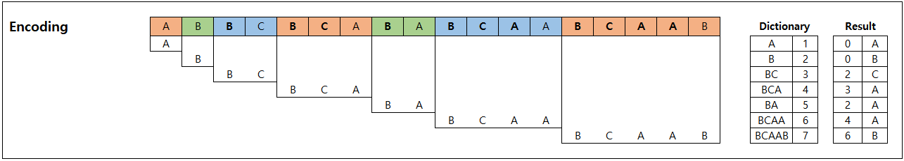
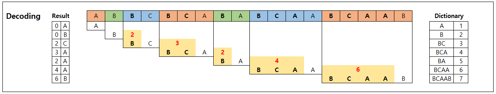
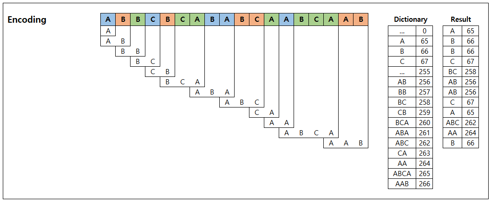
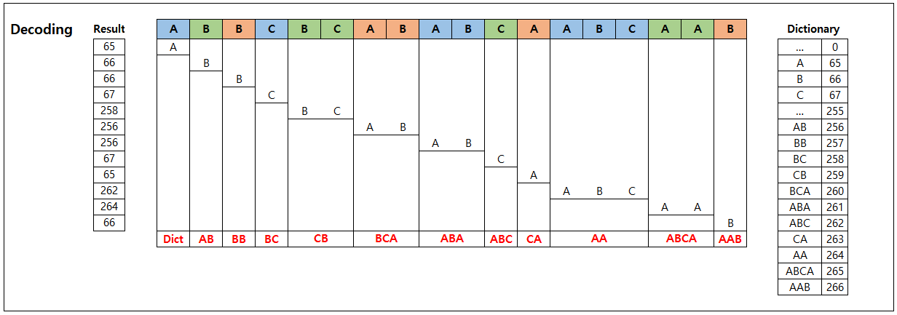

## Data Compression

### LZ78

*  [Abraham Lempel](https://en.wikipedia.org/wiki/Abraham_Lempel) 와 [Jacob Ziv](https://en.wikipedia.org/wiki/Jacob_Ziv) 에 의해 개발된 데이터 압축 알고리즘(1978년)
*  중복되는 패턴을 Dictionary에 저장한 뒤, Dictionary상의 위치로 치환하는 방식으로 Encoding

#### Encoding

* 주어진 Text의 각 Character를 Dictionary에서 확인
  * Dictionary에 존재하는 경우 다음 Character를 합쳐서(i.e, 'A' -> 'A' + 'F' -> 'AF') Dictionary 탐색
  * Dictionary에 존재하지 않는 패턴이 발생하게 되면, Dictionary를 확장하고 Output을 추가
    * 앞 단계서 넘어온 Character(w)를 Dictionary에 추가
    * 앞 단계서 넘어온 Character(w)의 Dictionary 번호와 현재 단계의 Character(c)를 Output에 추가
  * 마지막까지 남은 패턴의 경우 그대로 Output에 추가

  

#### Decoding

* Encoding의 Output(index, character 형태)을 다시 원래의 Text로 변경
* Dictionary를 생성하는 방식은 동일(방향이 반대)
  * Output의 index에 해당하는 Character와 Output의 character와 합쳐서 Dictionary에 추가하고, 해당 문자열을 Output Text에 추가
    (단, 0은 공백문자)
    

  

### LZW

*  [Abraham Lempel](https://en.wikipedia.org/wiki/Abraham_Lempel), [Jacob Ziv](https://en.wikipedia.org/wiki/Jacob_Ziv), [Terry Welch](https://en.wikipedia.org/wiki/Terry_Welch) 에 의해 개발된 데이터 압축 알고리즘(1984년)
* 기존 LZ78 알고리즘을 변경, 발전시킨 형태
* ASCII 코드를 이용하여 256개(0~255)의 Dictionary를 미리 생성하고, 새로운 패턴을 256번부터 추가하는 형태로 구현
* 이전 패턴의 마지막 Character와 Overlapping한 패턴을 Dictionary에서 찾고, 해단 Dictionary의 Value를 Output으로 저장

#### Encoding

* ASCII 코드 0~255에 해당하는 Dictionary 생성(*Key: Character, Value: ASCII#*)
* 첫번째 Character는 바로 Output으로 저장
* 두번째 Character 부터는 아래의 로직을 수행
  * 이전 단계의 패턴의 마지막 Character와 현재 Character를 합친 패턴을 Dictionary에서 검색
  * Dictionary에 존재하는 경우 다음 단계로 이동하여 새로운 패턴을 검색
  * Dictionary에 존재하지 않는 경우 해당 패턴을 Dictionary의 뒷부분(256~)에 추가
  * 이전 단계의 패턴의 Dictionary Value를 Output에 저장
* 마지막까지 남은 패턴의 경우 그대로 Output에 저장

#### Decoding

* Encoding과 동일한 ASCII Dictionary(0~255) 생성
* 첫번째 Character는 Dictionary에서 찾아 바로 Text에 추가
* 두번째 Character 부터는 아래의 로직을 수행
  * 각 Output에 해당하는 Character를 Text에 추가
  * 이전 Output의 Character와 현재 Output의 첫번째 Character 를 합친 패턴을 Dictionary 뒷부분(256~)에 추가

