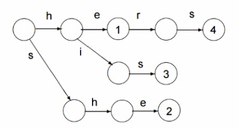

## Aho-Corasick Algorithm

### Aho-Corasick 알고리즘이란

* 하나의 Input text 에서 여러 종류의 Pattern을 찾기 위해 고안된 알고리즘
* Aho-Corasick 알고리즘의 기본은 Trie의 구성과 Trie 각 Node의 Failure Function의 구성
* **Trie 구성**
  * Trie는 n번째 node로 이동하는 edge를 각 Pattern의 character를 사용하는 개념
  * [he, she, his, hers] 의 Trie
    

* **Failure Function 구성**

  * Failure Function은 Root Node에서부터 BFS 탐색을 이용하여 계산

  * Root Node와 연결된 1,3번 Node의 Failure Function
    $$
    F(1) =F(3) = 0
    $$

  * 이후 Node에서의 Failure Function (i.e, 2, 8, 9번 Node)

    $$
    F(2) = G(F(1), e) = G(0, e) = 0\\
    F(8) = G(F(2), r) = G(0, r) = 0\\
    F(9) = G(F(8), s) = G(0, s) = 3
    $$

  * [he, she, his, hers]의 Failure Function
    

* Input text의 각 character를 생성된 Trie를 순회하면서 pattern이 완성되는지 여부를 확인
  (2, 5, 7, 9번 Node에서 pattern이 완성)

### 구현

#### buildTrie(arr, size, gotoMat, fail, output, result)

* Trie 생성 

   1. 주어진 pattern들(arr)에 대한 Trie(gotoMat), Failiure Function(fail), output Map(output) 생성

   2. Trie 생성 및 Output Table 생성
      1. Trie 초기화 (gotoMat의 모든 값을 -1로 입력)

      2. 각 pattern의 character를 순회하면서 gotoMat을 구성(gotoMat의 행은 출발 Node, 열은 character, 값은 도착 Node)

      3. character를 index 화하기 위해 ascii 코드로 변환 후 a의 ascii 코드를 차감

      4. Trie에 해당 Node가 존재하지 않는 경우 현재 sequence를 저장

         _* gotoMat: Trie를 표현한 Matrix_

         _* presentState: 현재 위치에서 이동할 Node 번호_

      5. Root Node에서 이동할 수 없는 character node의 값을 0으로 초기화

      6. 각 pattern의 마지막 character에 도달하면 해당 위치의 Node를 index로 Output 입력

         * output은 2진수 값으로 저장
         * i.e, 1번째 pattern = 0001, 2번째 pattern = 0010 ...

* Failure Function 생성 및 Output Table 갱신

   1. Root Node에서 이동가능한 Node의 Failure Function에 0(Root) 저장
      $$
      F(ch) = 0 \\ 
      s.t. G(0, ch) \neq 0
      $$

   2. Root Node에서 이동가능한 Node 번호를 Queue에 저장

   3. Queue가 빌 때까지 Iteration을 돌면서 Failure Function 계산

      1. 대상 Node에서 이동가능한 Node를 탐색
         _* state: 대상 Node_
         _* ch: 다음 Character_
         _* G(state, ch): 다음 Node_

      2. 다음 Node의 Failure Function을 구하기 위해 Failure Function을 iteration하면서 탐색

         1. 대상 Node의 Failure Function을 시작으로 탐색
         2. 이동 가능한 Node가 나오지 않을때까지 Failure Function의 Failure Function을 탐색
         3. Failure Function을 구한 뒤 다음 Node를 Queue에 저장

         $$
         nextState = G(state, ch)\\
         F(nextState) = G(\exists F(state),ch)\\
         s.t. G(\exists F(state), ch) \geq 0
         $$

      3. 다음 Node의 Output과 다음 Node의 Failure Function 값의 Output을 OR 비트 연산 수행

         * 특정 Node 도달 시 2개 이상의 pattern과 매칭되는 경우 대응
         * 1,3번째 pattern과 동일한 경우: 0001 OR 0100 = 0101

#### getNextState(presentState, nextChar, gotoMat, fail)

1. G(presentState, nextChar) 를 구현
2. G(presentState, nextChar)가 존재하지 않는 경우 presetnState를 Failure function(G(presentState, nextChar))로 변경하여 반복 수행

#### patternSearch(arr, size, text)

1. 주어진 Pattern과 InputText를 이용하여 Trie, Failure Function, Output을 생성
   _buildTrie(arr, size, gotoMat, fail, output, result)_
2. Input Text의 각 character에 대해 iteration 수행
3. character를 이용하여 Trie를 탐색
   _getNextState(presentState, nextChar, gotoMat, fail) // G(현재 Node, 다음 character)_
4. 탐색 결과 Node의 output이 존재하는 경우 해당 output이 어떤 pattern인지 확인(비트연산)

### Usage

```python
import pmat_aho_corasick

arr = ['he', 'she', 'his', 'hers']
k = len(arr)
text = 'ahishers'

result, _ = pmat_aho_corasick.patternSearch(arr, k, text)
# result = {'he': [5], 'she': [5], 'hers': [7], 'his': [3]}

for key in result.keys():
    for end in result[key]:
        start = end + 1 - len(key)

# he
# she
# hers
# his
```


### References

* https://www.tutorialspoint.com/Aho-Corasick-Algorithm
* https://www.geeksforgeeks.org/aho-corasick-algorithm-pattern-searching/
* http://channelofchaos.tistory.com/2
* http://blog.myungwoo.kr/101


