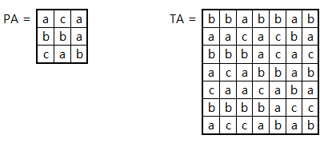
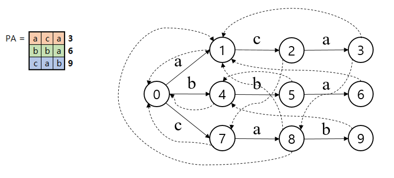
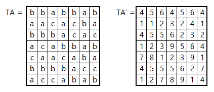
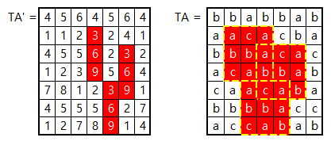
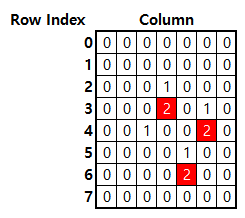

## Baker-Bird Algorithm

### Baker-Bird 알고리즘이란

* Baker-Bird 알고리즘은 2차원 배열의 패턴을 탐지하기 위한 알고리즘
* 기본적으로 Aho-Corasick Algorithm과 KMP Algorithm을 이용하여 각각 행과 열의 패턴을 탐지
  * 각 Row에 Aho-Corasick Algorithm을 통해 Input Text의 모든 Character의 Node 위치를 탐색
  * Input Text의 Character의 Node 위치로 변경한 뒤 KMP Algorithm을 이용하여 원하는 Node 위치를 탐색



* **Row에 대한 Aho-Corasick Algorithm**

    * Pattern의 각 행들의 집합을 Text이자 Pattern으로 하는 Aho-Corasick Algorithm 수행(PA)
    * Input Text의 각 행을 Text로, Pattern의 각 행들의 집합을 Pattern으로 하는 Aho-Corasick Algorithm 수행

    

    * Aho-Corasick의 Trie에 따라 Input Text의 모든 Text를 Node 위치로 변경(TA')

    

* Column에 대한 KMP Algorithm

    * Node 위치로 변경된 Input Text의 각 Column을 Text로, Pattern의 Aho-Corasick Algorithm의 결과의 마지막 컬럼의 집합을 Pattern으로 KMP Algorithm 수행
        * Aho-Corasick Algorithm을 통해 Pattern 마지막 Column의 Node 위치는 Pattern이 되는 Unique한 값

    

### 구현

#### patternSearch(text, pattern)

1. 입력된 Pattern을 각 Row의 List로 변환한 뒤 Aho-Corasick Algorithm의 patternSearch(p, p의 길이, p) 수행
   * Aho-Corasick의 결과 중 Node 위치 Output의 마지막 Column들을 하나의 String으로 변환(KMP_P)
2. 입력된 Input Text를 각 Row의 List로 변환한 뒤 Aho-Corasick Algorithm의 patternSearch(p, p의 길이, t) 수행 
   * Aho-Corasick의 결과 중 Node 위치 Output를 각 Row의 List로 변환(KMP_T)
3. 2에서 변환된 Node 위치의 Row List(KMP_T)를 Iteration
   1. 각 Row를 Input Text, 1에서 추출한 KMP_P를 Pattern으로 KMP Algorithm의 patternSearch(KMP_T, KMP_P) 수행
   2. KMP의 수행 결과가 존재하는 경우 Iteration의 Index(Column Index)와 KMP의 결과(Row Index)를 반환

### Usage

``` python
import pmat_baker_bird

text = ['bbabbab', 'aacacba', 'bbbacac', 'acabbab', 'caacaba', 'bbbbacc', 'accabab']
pattern = ['aca', 'bba', 'cab']

result = pmat_baker_bird.patternSearch(text, pattern)
# result = [(3, 3), (6, 4), (4, 5)]

for (er, ec) in result:
    for row in range(er-len(p[0])+1, er+1):
        print(t[row][ec-len(p[0])+1:ec+1])
    print('-----')
# aca
# bba
# cab
# -----
# aca
# bba
# cab
# -----
# aca
# bba
# cab
# -----
```

----

## Interleave를 이용한 Baker Bird Algorithm

### Interleave란

* 기본적인 Baker Bird Algorithm은 각 Row에 대한 Aho-Corasick Algorithm을 수행한 뒤 각 Column에 대한 KMP Algorithm을 수행

  * 이 때, KMP Algorithm을 Column의 수만큼 수행하는 비효율성이 발생

* 이를 보완하기 위해서 Aho-Corasick Algorithm과 KMP Algorithm을 서로 교차하여 수행(Interleave)함으로써 전체 Input Text에 대한 한 번의 탐색으로 결과를 도출

  * 각 Row에 대한 Aho-Corasick Algorithm 수행 직후, KMP Algorithm의 Step 1회를 수행

* **KMP Algorithm을 위한 준비**

  * 기존 Baker Bird Algorithm과 동일하게 Aho-corasick Algorithm을 통해 KMP_P를 추출
  * KMP Algorithm의 getPi(pattern)을 수행하여 KMP_Failure_Function을 구성

* **Row Iteration 수행(Aho-Corasick Algorithm과 KMP Algorithm의 Interleave)**

  * 기존 Baker Bird Algorithm과 동일하게 Aho-corasick Algorithm을 통해 KMP_T를 추출

  * KMP_T에 대한 Iteration(Row Iteration) 수행

    * KMP_T(1개의 Row)의 각 Element(각 Column)을 KMP_P의 j번째 자리의 character와 비교
    * KMP Algorithm과 동일하게 수행되나 j가 Column 의 수만큼 존재 (List, Array 등을 사용하여 관리)
    * j가 KMP_P의 길이만큼 증가하는 경우 KMP_T Iteration의 Index(Row Index)와 KMP 비교의 Iteration(Column Index)를 반환

    

### 구현

#### patternSearch(text, pattern)

1. 입력된 Pattern을 각 Row의 List로 변환한 뒤 Aho-Corasick Algorithm의 patternSearch(p, p의 길이, p) 수행

   - Aho-Corasick의 결과 중 Node 위치 Output의 마지막 Column들을 하나의 String으로 변환(KMP_P)

2. KMP_P를 이용하여 KMP의 Failure Function 생성( getPi(KMP_P) )

3. 입력된 Input Text를 각 Row의 List로 변환

4. KMP의 j(Pattern Character Index)들을 저장하기 위한 배열 선언(js)

5. 2의 List를 Iteration(각 Row)

   1. 각 Row별 Aho-Corasick Algorithm의 patternSearch(p, p의 길이, t) 수행 

   - Aho-Corasick의 결과 중 Node 위치 Output를 KMP의 Input Text로 저장(KMP_T)

6. 1의 KMP_P와 4의 KMP_T를 이용하여 KMP Algorithm 수행

   1. KMP_T의 각 Character를 KMP_P의 j번째 Character와 비교
      _* 이 때의 j는 j의 배열에서 KMP_T의 Character Index에 해당하는 j값을 사용_
   2. j가 0이 아니고 Character가 서로 다른 경우 j를 pi[j]로 이동 후 다시 비교
   3. Character가 서로 동일한 경우 pattern을 찾거나(마지막), 1 증가시킨 j를 js에 저장한 뒤 종료

### Usage

``` python
import pmat_baker_bird_interleave

text = ['bbabbab', 'aacacba', 'bbbacac', 'acabbab', 'caacaba', 'bbbbacc', 'accabab']
pattern = ['aca', 'bba', 'cab']

result = pmat_baker_bird_interleave.patternSearch(t, p)
# result = [(3, 3), (4, 5), (6, 4)]

for (er, ec) in result:
    for row in range(er-len(p[0])+1, er+1):
        print(t[row][ec-len(p[0])+1:ec+1])
	print('-----')
        
# aca
# bba
# cab
# -----
# aca
# bba
# cab
# -----
# aca
# bba
# cab
# -----        

```

----

### References

* http://www.stringology.org/papers/Zdarek-PhD_thesis-2010.pdf